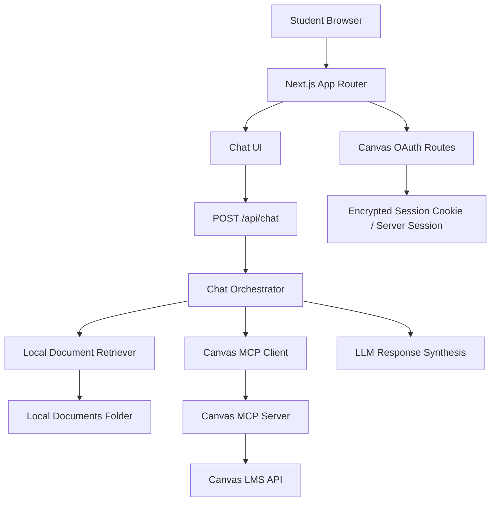

# Design: Canvas Chat MCP

## Product Goal

Build a student chatbot that starts useful without authentication by answering from a local folder of course documents, then becomes student-specific after Canvas login by querying the student's Canvas account through the Canvas MCP server.

The app must keep Canvas tokens server-side, avoid writing to Canvas, and ground answers in either local document snippets or Canvas MCP tool results.

## Target Architecture

## Core Modes

| Mode | Authentication | Data source | Expected behavior |
|---|---|---|---|
| Local documents | Not required | `LOCAL_DOCUMENTS_DIR` | Search local course files and answer with citations |
| Canvas | Required | Canvas MCP tools | Answer only from the logged-in student's Canvas data |
| Auto | Optional | Local first, Canvas when authenticated | Use Canvas for student-specific questions when a session exists |

## Component Map

| Component | Purpose | Location |
|---|---|---|
| Chat interface | Student-facing conversation UI | `frontend/src/app/chat` |
| Chat API route | Server-side entry point for all chat requests | `frontend/src/app/api/chat/route.ts` |
| Local document retriever | Reads and ranks local files | planned under `frontend/src/lib/server/` |
| Canvas auth routes | OAuth start/callback/logout | planned under `frontend/src/app/api/auth/canvas/` |
| Canvas MCP client | Starts or connects to the Canvas MCP server with a student token | planned under `frontend/src/lib/server/canvas-mcp.ts` |
| Chat orchestrator | Selects local docs or Canvas MCP, then synthesizes an answer | planned under `frontend/src/lib/server/chat/` |

## Canvas Authentication

Students must authenticate before Canvas data is used. The browser should never receive or send a Canvas API token directly. The target flow is:

1. Student clicks "Sign in with Canvas".
2. Next.js redirects to Canvas OAuth.
3. Canvas redirects back to `/api/auth/canvas/callback`.
4. The server exchanges the code for a Canvas token.
5. The token is stored server-side or sealed in an encrypted, HTTP-only session.
6. `/api/chat` uses the token to scope Canvas MCP calls to that student.

## Canvas MCP Scope

The app should expose a deliberately small read-only tool surface to the model:

- `list_courses`
- `list_assignments`
- `list_discussion_topics` with announcements-only behavior enforced server-side
- `get_my_course_grades`

The model should never be given write-capable Canvas tools.

## Local Document Scope

Local document mode should support:

- Markdown and text in the first pass
- PDF and DOCX extraction before production
- chunking, retrieval, and citations
- a reindex action for development
- an ignored local index directory so student or course content is not committed accidentally

## Key Decisions

| Decision | Choice | Reason |
|---|---|---|
| App shape | Single Next.js app | Avoids maintaining a separate FastAPI service for a web-first MVP |
| Canvas token handling | Server-side only | Prevents token exposure in browser code |
| Canvas access | MCP, read-only | Keeps Canvas integration narrow and auditable |
| Local documents | Folder-backed retrieval | Lets the app work before Canvas auth is available |
| Answer grounding | Require citations or explicit "not found" | Reduces hallucinated student advice |

## Non-Goals For MVP

- Writing to Canvas
- Cross-student analytics
- Persistent long-term chat history
- Admin dashboards
- General essay writing or non-course tutoring outside provided documents and Canvas data
